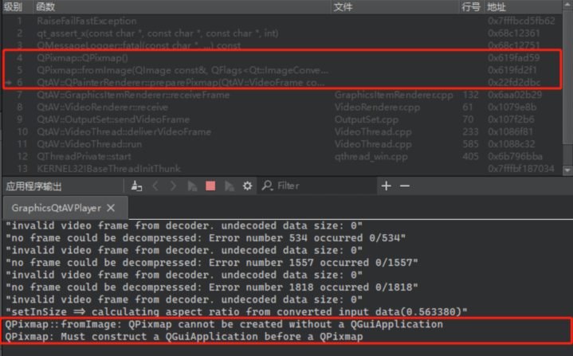

# Tiny QtAV Player

Original name: A Player of QtAV

[QtAV](https://github.com/wang-bin/QtAV) is a cross-platform multimedia player framework based on Qt and FFmpeg, it uses FFmpeg to convert video and audio codec and shows video frame and interactive components through Qt framework. 

QtAV's official website is [http://www.qtav.org](http://www.qtav.org).

The latest version of QtAV is 1.12.0 public released at June 21, 2017. It has a long time since last released. Developing version now at 1.13.

The using instructions of QtAV please refer to project WIKI.

## The Issue

The renderer module of QtAV, QPainterRenderer classes will crush the program with a Qt error message below, eg:

``` text
QPixmap: Must construct a QGuiApplication before a QPixmap
```

After research for long time, many solutions says the compiling type need setting to 'Release' rather than 'Debug'. 'Release' setting will link DLL to 'QtAVWidgets1.dll' rather than 'QtAVWidgetsd1.dll', the program runs normally but I still not figured out how it works.

But this isn't a prefect solution, and calling FFmpeg api functions directly not a good plan either.

So I decided to build a simple player to fix the problem.

## Environment

Because of the problem-solving is the most important thing, so the project not consider to complex scenes, therefore to open these source code to be a reference to yours.

* Platform: Windows 8.1 x86_64 self-customized
* QtSDK: Qt 5.12.12 MinGW 730_64
* QtAV: QtAV 1.13.0
* Mailstone Target: Implementing a QGraphicsItem rendering using QtAVWidgets
* Don't use OpenGL yet

## Researching

Qt reports the problem caused by QPixmap, and found the private of QPainterRender class use the QPixmap to save every video frame picture, so that QPainter will draw the pixmap to widget and show on screen when called drawBackground/drawFrame.

Nevertheless the QPixmap cause the problem.

There's a new thread created when QtAV drawing video frames at my debugging memory calling function stack, I consider the thread is not created from QApplication, or QPixmap not found any qApp instance in construct function, then has a failure at assert situation.



## Solution

Since QPixmap can cause the problem, now that the solution drops QPixmap and turning to QImage as a image painter.

Implement RPainterRenderer classes and inherit from QtAV::VideoRenderer, the calling/inheritance layer is as follows:

```text
QGraphicsScene
+-- RGraphicsItemRenderer (QGraphicsItem)
    !-- RPainterRenderer
        !-- QtAV::VideoRenderer
            !-- ...
```

This project include RPainterRenderer class and its private class, uses QImage to process video frame and paint to widget instead of QPixmap. RGraphicsItemRenderer and its private class will show video frame as a QGraphicsItem so that can use by QGraphicsScene.

## Optimization

QPainterRenderer original render path is QImage -> QPixmap::fromImage -> QPainter::drawPixmap(..., QPixmap), contains lots of memory copy, new solution uses only one fix-sized QImage to save CPU object-created timing.

Uses only single memory copy from videoFrame to QImage.

Even though single-copy painting, it still needs more CPU times than OpenGL painting, therefore, consider OpenGL painting on QGraphicsItem to improve efficiency.
